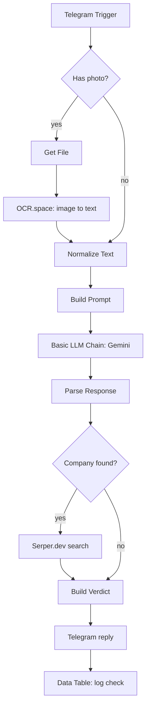

# 🚨 Internship & Job Scam Detector

A Telegram bot that helps students check whether an internship or job posting looks like a scam. Send it the posting as **text or a screenshot**, and it replies with a risk level, the red flags it found, and a quick check on whether the company exists online. It is built with **n8n**, an LLM, OCR, and a search API.

> ⚠️ **Disclaimer:** This tool gives guidance, not a guarantee. Always verify an employer directly before sharing personal details or paying anything.

---

## Screenshots

**1. Full workflow in n8n**


**2. Example execution (green lines show the path the data took)**


**3. The reply the user receives on Telegram**


Example reply format:

```
🚨 Risk: HIGH

The posting demands an upfront fee and uses urgency to pressure applicants.

Red flags:
• Asks for a one-time registration fee
• Unrealistic pay for no experience
• Urgency language ("apply within 24 hours")
• Contact through WhatsApp only
```

---

## How it works



1. **Input:** the user sends a text message or a photo to the bot.
2. **OCR:** photos are downloaded from Telegram and converted to text with OCR.space. Text messages skip this step.
3. **Normalize:** both paths are merged into one `text` + `chatId` payload.
4. **Analysis:** the text is wrapped in a prompt asking the LLM for strict JSON: `riskLevel`, `redFlags`, `summary`, `companyName`.
5. **Parsing:** a Code node strips markdown fences and parses the JSON. If the model returns something invalid, the workflow falls back to an "unknown" result instead of crashing.
6. **Company check:** if a company name was extracted, Serper.dev runs a Google search. If the search returns nothing, that is flagged as a warning. If the search itself fails, the bot says it could not check, rather than treating it as a red flag.
7. **Reply and log:** the verdict is sent back on Telegram and every check is saved to an n8n Data Table.

---

## Tech stack

| Purpose | Tool |
|---|---|
| Workflow automation | [n8n](https://n8n.io) |
| Chat interface | Telegram Bot API |
| Local tunnel for webhooks | ngrok |
| Image to text | [OCR.space](https://ocr.space/ocrapi) |
| Scam analysis | Google Gemini (via n8n's Gemini Chat Model + Basic LLM Chain) |
| Company lookup | [Serper.dev](https://serper.dev) (Google Search API) |
| Logging | n8n Data Tables |

---

## Setup

### Prerequisites
- An n8n instance (self-hosted or n8n Cloud)
- A Telegram bot token from [@BotFather](https://t.me/BotFather)
- ngrok (only if running n8n locally, so Telegram can reach your webhook)
- Free API keys for OCR.space, Serper.dev, and Google AI Studio (Gemini)

### Build overview
The workflow is built in n8n from the nodes shown in the diagram above.

1. **Telegram Trigger:** create a bot with @BotFather, add the token as a Telegram credential in n8n, and (if running locally) expose n8n with ngrok so Telegram can reach the webhook.
2. **Has photo? (IF):** checks whether the incoming message contains a photo. Photo messages go to **Get File**, then an **HTTP Request** to OCR.space (multipart form-data, file field `file`, header `apikey`).
3. **Normalize Text (Code):** merges the photo and text paths into one `text` + `chatId` payload.
4. **Build Prompt (Code):** wraps the posting in instructions asking the model for strict JSON (`riskLevel`, `redFlags`, `summary`, `companyName`).
5. **Basic LLM Chain + Google Gemini Chat Model:** runs the analysis. A fast Flash-tier model with a low temperature (0.2) works best for this task.
6. **Parse Response (Code):** cleans and parses the JSON, with a safe fallback if the model returns something invalid.
7. **Company found? (IF):** if a company name was extracted, **Serper Search** (HTTP Request to `https://google.serper.dev/search`, header `X-API-KEY`) checks whether it appears online. Set the node's *On Error* to *Continue* so a failed search doesn't stop the run.
8. **Build Verdict (Code):** formats the final Telegram message and the `companyVerified` flag.
9. **Telegram reply and Data Table:** sends the message (Markdown parse mode) and logs each check to a data table named `Scam Checks` with columns `riskLevel`, `summary`, `companyName`, `companyVerified`, `checkedAt`.
10. **Publish** the workflow and message your bot.

> 🔐 Keep your API keys in n8n credentials or private settings only. Never commit real keys to a public repo.

---

## Usage

Send the bot any of the following:
- A pasted job or internship description
- A screenshot of a posting (LinkedIn, WhatsApp, Instagram, etc.)

It replies with a risk level (🚨 high, ⚠️ medium, ✅ low), a list of red flags, and a company check.

---

## Testing

I tested the bot with a mix of obvious scams, borderline postings, and legitimate ones, in both text and screenshot form.

<!-- Fill in your real results after running your test set -->

| Test set | Postings | Correct | Notes |
|---|---|---|---|
| Obvious scams | `N` | `N` | |
| Legitimate postings | `N` | `N` | |
| Borderline / ambiguous | `N` | `N` | |
| Screenshots (OCR path) | `N` | `N` | |

---

## Limitations

- **"Found online" is a weak signal.** Google returns results for almost any name, including fake companies, so this check should be read as a hint, not proof.
- **LLM judgment is imperfect.** It can miss subtle scams or over-flag unusual but legitimate postings.
- **OCR quality varies.** Blurry or stylized screenshots may produce garbled text.
- **Runs on a local machine.** With ngrok, the bot goes offline when the host does.
- **No abuse protection yet.** There is no rate limiting or spam handling.

## Future improvements

- Stronger verification: sender email domain vs. company name, domain age lookup, searching the company name alongside "scam"
- Friendly fallback message when OCR returns no readable text
- Hosted deployment so the bot is always on
- A `/start` command explaining what the bot does
- A larger labeled test set to track accuracy over time

---

## Project structure

```
.
├── README.md
└── screenshots/
    ├── 1-workflow.png
    ├── 2-execution.png
    └── 3-telegram-reply.png
```

---

## License

Released under the MIT License.

## Author

**MONICA R** · [GitHub](https://github.com/monica1620) · [LinkedIn](https://linkedin.com/in/monicaa16)
